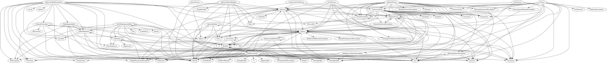

# Code of your exercise

Le code de cet exercice ainsi que les captures d'écran nécessaires sont fournis ci-dessous.





```java
package fr.istic.vv.Exercise6;

import com.github.javaparser.ast.CompilationUnit;
import com.github.javaparser.ast.body.ClassOrInterfaceDeclaration;
import com.github.javaparser.ast.body.MethodDeclaration;
import com.github.javaparser.ast.expr.FieldAccessExpr;
import com.github.javaparser.ast.type.ClassOrInterfaceType;
import com.github.javaparser.utils.SourceRoot;

import java.io.FileWriter;
import java.nio.file.Paths;
import java.util.*;

public class ClassCohesionCalculator {

    public static void main(String[] args) {
        if (args.length != 1) {
            System.out.println("Usage: java ClassCohesionCalculator <path-to-source>");
            return;
        }
    
        String sourcePath = args[0];
    
        try {
            ClassCohesionCalculator calculator = new ClassCohesionCalculator();
            Map<String, Double> classCohesion = calculator.analyzeProject(sourcePath);
            
            for (Map.Entry<String, Double> entry : classCohesion.entrySet()) {
                String className = entry.getKey();
                Double cohesion = entry.getValue();
                System.out.println(String.format("%s : Cohesion = %.2f", className, cohesion));
            }

            Map<String, Map<String, Double>> allProjectCohesion = new HashMap<>();
            allProjectCohesion.put(sourcePath, classCohesion);
            generateCohesionHistogram(allProjectCohesion);

            Map<String, Set<String>> projectDependencies = calculator.findDependencies(sourcePath);
            Map<String, Map<String, Set<String>>> allProjectDependencies = new HashMap<>();
            allProjectDependencies.put(sourcePath, projectDependencies);
            
            generateDependencyGraphs(allProjectDependencies);

        } catch (Exception e) {
            e.printStackTrace();
        }
    }

    /**
     * Analyse le projet source et calcule la cohésion pour chaque classe publique.
     */
    public Map<String, Double> analyzeProject(String sourcePath) throws Exception {
        Map<String, Double> classCohesion = new HashMap<>();
    
        SourceRoot sourceRoot = new SourceRoot(Paths.get(sourcePath));
        sourceRoot.tryToParseParallelized();
    
        for (CompilationUnit cu : sourceRoot.getCompilationUnits()) {
            for (ClassOrInterfaceDeclaration cls : cu.findAll(ClassOrInterfaceDeclaration.class)) {
                if (cls.isPublic()) {
                    double cohesion = calculateCohesion(cls);
                    classCohesion.put(cls.getNameAsString(), cohesion);
                }
            }
        }
    
        return classCohesion;
    }

    /**
     * Trouve toutes les dépendances entre les classes du projet.
     */
    public Map<String, Set<String>> findDependencies(String sourcePath) throws Exception {
        Map<String, Set<String>> dependencies = new HashMap<>();
        
        SourceRoot sourceRoot = new SourceRoot(Paths.get(sourcePath));
        sourceRoot.tryToParseParallelized();
        
        for (CompilationUnit cu : sourceRoot.getCompilationUnits()) {
            for (ClassOrInterfaceDeclaration cls : cu.findAll(ClassOrInterfaceDeclaration.class)) {
                if (cls.isPublic()) {
                    Set<String> classDependencies = new HashSet<>();
                    
                    cls.getFields().forEach(field -> {
                        field.getVariable(0).getType().ifClassOrInterfaceType(type -> {
                            classDependencies.add(type.getNameAsString());
                        });
                    });
                    
                    cls.getMethods().forEach(method -> {
                        method.findAll(ClassOrInterfaceType.class).forEach(type -> {
                            classDependencies.add(type.getNameAsString());
                        });
                    });
                    
                    dependencies.put(cls.getNameAsString(), classDependencies);
                }
            }
        }
        
        return dependencies;
    }

    /**
     * Calcule la cohésion d'une classe en fonction du nombre de méthodes qui accèdent aux champs.
     */
    private double calculateCohesion(ClassOrInterfaceDeclaration cls) {
        if (cls.getMethods().isEmpty()) {
            return 0.0;
        }

        long fieldAccessingMethods = 0;
        for (MethodDeclaration method : cls.getMethods()) {
            if (method.findAll(com.github.javaparser.ast.expr.FieldAccessExpr.class).size() > 0) {
                fieldAccessingMethods++;
            }
        }
        
        return (double) fieldAccessingMethods / cls.getMethods().size();
    }

    /**
     * Génère un histogramme des valeurs de cohésion.
     */
    private static void generateCohesionHistogram(Map<String, Map<String, Double>> allProjectCohesion) {
        for (Map.Entry<String, Map<String, Double>> project : allProjectCohesion.entrySet()) {
            Map<String, Double> cohesionValues = project.getValue();
            Map<Double, Integer> cohesionFrequency = new HashMap<>();
            
            for (Double cohesion : cohesionValues.values()) {
                cohesionFrequency.merge(cohesion, 1, Integer::sum);
            }

            System.out.println("Cohesion Histogram for Project: " + project.getKey());
            cohesionFrequency.forEach((cohesion, count) -> 
                System.out.println("Cohesion " + cohesion + ": " + count + " classes")
            );
        }
    }

    /**
     * Génère et sauvegarde le graphe de dépendances au format DOT.
     */
    private static void generateDependencyGraphs(Map<String, Map<String, Set<String>>> allProjectDependencies) {
        for (Map.Entry<String, Map<String, Set<String>>> project : allProjectDependencies.entrySet()) {
            String projectName = project.getKey();
            Map<String, Set<String>> dependencies = project.getValue();
            StringBuilder dotGraph = new StringBuilder();
            dotGraph.append("digraph G {\n");

            for (Map.Entry<String, Set<String>> classDependencies : dependencies.entrySet()) {
                String className = classDependencies.getKey();
                Set<String> dependentClasses = classDependencies.getValue();
                for (String dependentClass : dependentClasses) {
                    dotGraph.append("\"").append(className).append("\" -> \"").append(dependentClass).append("\";\n");
                }
            }

            dotGraph.append("}\n");

            try (FileWriter writer = new FileWriter(projectName + "_dependency_graph.dot")) {
                writer.write(dotGraph.toString());
                System.out.println("Dependency graph saved to: " + projectName + "_dependency_graph.dot");
            } catch (Exception e) {
                System.err.println("Error saving dependency graph: " + e.getMessage());
                e.printStackTrace();
            }
        }
    }
}
```